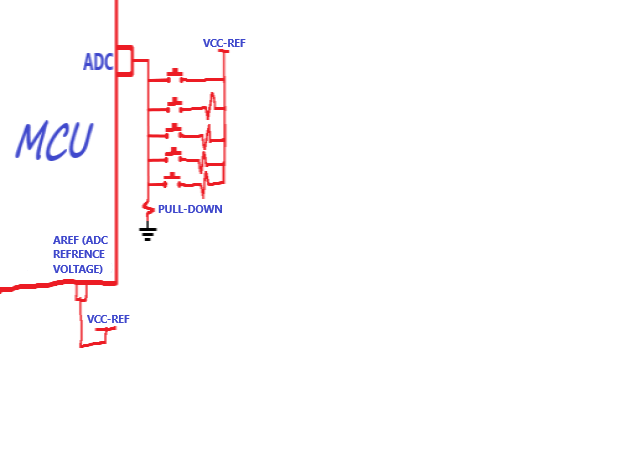

# ADC-multiple_key_read
reading multiple key with ADC

you can use multiple key with this methode it's standard in a way but you should be aware that it is not for lot's of keys.if you want the algorithm of this methode send me message.
